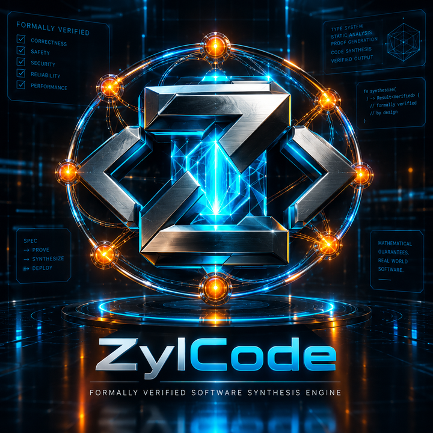

# ZylCode

<p align="center">
  
</p>

<p align="center">
  <strong>Evidence-First Software Creation OS</strong><br>
  <em>Local-first, Windows-verified. Aiming at the full loop: design → build → run → see → verify → ship.</em>
</p>

<p align="center">
  <a href="#features">Features</a> •
  <a href="#installation">Installation</a> •
  <a href="#quick-start">Quick Start</a> •
  <a href="#documentation">Documentation</a> •
  <a href="#contributing">Contributing</a> •
  <a href="#license">License</a>
</p>

---

> ## ⚠️ Read the governance documents first
>
> **The governing specification is `docs/governance/` — not this README.**
> Where this README and a governance document disagree, **the governance document wins**.
>
> ```
> docs/governance/README.md                              ← start here (index)
> docs/governance/ZYLCODE_PRODUCT_CONSTITUTION_V2.md     ← supreme spec
> docs/governance/ZYLCODE_ARCHITECTURE_V2.md
> docs/governance/ZYLCODE_MASTER_EXECUTION_PLAN.md
> docs/governance/ZYLCODE_PROOF_GRAPH.md                 ← R0–R5, authoritative
> docs/governance/ZYLCODE_CAPABILITY_MODEL.md            ← what "GREEN" means
> docs/governance/ZYLCODE_AGENT_OPERATING_PROTOCOL.md    ← mandatory for agents
> docs/roadmap/ZYLCODE_ROADMAP_V2.md                     ← 16 phases / 6 epochs
> ```
>
> **Every prompt to an implementation agent must begin with:**
>
> > Read the ZylCode Constitution, Architecture, Master Execution Plan, Capability Model and
> > Proof Graph, plus the current phase specification. They govern implementation. Where
> > implementation conflicts with documentation, investigate the discrepancy rather than
> > silently choosing one.
>
> ### Status key
>
> | Marker | Meaning |
> |---|---|
> | 🟢 | **R3+** — Reachable through a named product surface with captured evidence |
> | 🔵 | **R2** — Executed under automated test, not yet reachable by a user or agent |
> | ⚪ | **R1** — Observed once informally, no procedure |
> | 🟡 | **IN DEVELOPMENT** — Backend or partial implementation in progress |
> | 🟣 | **PROPOSED** — Specified in governance, no implementation |
> | 🔴 | **BLOCKED** — Cannot begin until a dependency is accepted |
>
> ### Engineering roadmap
>
> | Phase | Status |
> |---|---|
> | 1A–1D — tool runtime, agent loop, model-driven agent, durable memory | 🟢 Accepted (1C, 1D with conditions) |
> | **2A — Repository Intelligence Foundation** | 🔴 **NOT ACCEPTED — re-opened**; all three rejection findings remediated in code (see below) — re-audit pending |
> | 2B — Repository Reasoning & Impact Analysis | 🔴 **Blocked** on 2A |
> | UX-01C — Secure local project workspace backend | 🟢 **Live** — workspace surfaces (explorer, editor, missions) reachable in the IDE |
> | 3A–16 — Project System frontend, Vision Studio, Device Labs, Delivery, Ecosystem | 🟣 Not started |
>
> Phase 2A was rejected by independent audit: its headline metric counted `target/` build output
> (14,900 of 15,064 indexed files; the repository is 254 files), its benchmark fails on
> re-execution, and it has zero product integration.
> See `docs/governance/PHASE2A_INDEPENDENT_AUDIT.md`.
>
> **Remediation status (code shipped; acceptance awaits re-audit):** the metric now counts
> real, gitignore-respecting sources (the scanner's output — hundreds, not 15k); the index is
> persisted and re-verified on load (no per-invocation re-index); and integration is shipped
> as committed entry points: `serve-intel` HTTP routes (`/api/repo-intel`, `/api/search`,
> `/api/files`, `/api/evidence`), Tauri commands, and IDE surfaces (Explorer, Search, Editor,
> Evidence timeline, mission planning) — with a hash-chained evidence ledger recording real
> Best-of-N verification runs. Rung assignment follows §6 of the proof graph: computed from
> committed entry points + reachability + captured evidence, not asserted.

---

## 🚀 Overview

**ZylCode** is an evidence-first, autonomous software engineering platform. It aims to take
software from intent to a **verified deliverable** — *Imagine → Specify → Design → Build → Run →
See → Test → Repair → Verify → Ship* — rather than merely generating code.

Built with Rust for the engine and React + Tauri for the desktop shell. Designed for
**Windows first**, then macOS and Linux.

**What works today:** a real tool runtime (filesystem, shell, git, search), a bounded agent
execution loop with model-driven decisions, a durable evidence ledger, permission enforcement,
and crash recovery.

**What does not exist yet:** Vision Studio, Delivery Engine, device labs, and the extension
marketplace. The Project System store, Artifact Bus, Proof Engine, and mission approval/verify
states now exist and are tested (see the status table) — their product surfaces are still being
built out, and no roadmap item should be mistaken for a capability.

### Why ZylCode?

Status markers follow `docs/governance/ZYLCODE_PROOF_GRAPH.md`.
**R3 = reachable and usable with captured evidence. R2 = tested but not reachable. PROPOSED = does not exist.**

| Feature | Status |
|---|---|
| **Evidence Ledger** | 🟢 R3 — append-only, hash-chained |
| **Permission Gate** | 🟢 R3 — fail-closed, risk-classified |
| **Crash Recovery** | 🟢 R3 — resumable, reconciled against git |
| **Real Tool Execution** | 🟢 R3 — Filesystem, Shell, Git, Search |
| **Bounded Execution** | 🟢 R3 — steps, timeouts, cancellation |
| **Proof / Evidence Model** | 🟢 **ACTIVE GOVERNANCE** — R0–R5 ladder defined and enforced |
| **Proof Engine** | 🟣 **PROPOSED → foundation landed** — hash-chained proof records with honest states (Passed/NotRun/Blocked/RuntimeNotReached/EvidenceMissing), acceptance gates, tamper detection; tested, service route live |
| **Artifact Bus** | 🟣 **PROPOSED → foundation landed** — versioned content-hashed artifacts with forward-only lifecycle; tested, service route live |
| **Project System (persistence)** | 🟣 **NEW** — schema-versioned project store with migration, recovery, import/export; survives restart (tested) |
| **Model Democracy** | 🟢 **R3 (read) / R3 (routing foundation)** — provider chain, metrics, AND measured scorecard routing served read-only over HTTP+Tauri; dispatch order follows recorded outcomes once samples exist |
| **Repository Intelligence** | 🟢 **R3** — reachable: HTTP routes, Tauri commands, IDE surfaces, verified ledger-backed evidence |
| **Project System** | 🟢 **R3 (core)** — real workspace surfaces (explorer, editor, missions) live in the IDE |
| **Vision Studio** | 🟣 **PROPOSED** (Phase 8A–9) |
| **Plugin Marketplace** | 🟣 **PROPOSED** (Phase 15) |
| **Cross-Platform** | 🟡 Windows verified; macOS/Linux configured, unverified |
| **Offline Capable** | 🟡 Local-first by design; offline dispatch path hermetic and tested |
| **GUI + CLI** | 🟢 Both |

> Claims above are held to `ZYLCODE_CAPABILITY_MODEL.md` §4.2: **GREEN requires R3.** Nothing is
> described as working below its rung.

---

## ✨ Features

### 🛠️ Real Tool Execution (Verifiable Automation)

ZylCode features a **Real Tool Runtime** that actually executes operations with full evidence:

- **Filesystem**: Read, write, and list files with actual I/O operations
- **Terminal**: Execute shell commands with stdout/stderr streaming
- **Git**: Perform actual git operations (status, diff, commit)
- **Search**: Search repositories with actual file system traversal
- **Execution Evidence**: Every tool execution is recorded with full audit trail

### ⚡ Evidence-First Architecture

ZylCode's defining principle: **a claim is not a fact until it is independently reproducible.**

Every capability carries a proof rung. The authoritative definition is
`docs/governance/ZYLCODE_PROOF_GRAPH.md`.

| Rung | Name | Meaning |
|---|---|---|
| **R0** | CLAIMED | Asserted in a document. No artifact. |
| **R1** | OBSERVED | Seen once, informally. No procedure. |
| **R2** | EXECUTED | Runs under automated test. **Not reachable by a user or agent.** |
| **R3** | VERIFIED | Reachable through a named product surface, with captured evidence. |
| **R4** | REPRODUCIBLE | A third party re-runs a committed procedure and gets the same result. |
| **R5** | COMMISSIONED | Independently audited by a party that did not build it, and accepted. |

> **R2 is a library. R3 is a capability.**
>
> A module with passing unit tests that no user or agent can invoke is **R2** — regardless of
> coverage. This distinction is the load-bearing rule of the whole program, and it is what
> caught the Phase 2A overclaim.

**This ladder is capability-agnostic.** It applies to a UI feature, a parser, a deployment path
or a model route — not only to source code. It **supersedes** the earlier build-centric ladder
(`R0 model output / R1 syntax / R2 compiles / R3 tests pass / R4 integration / R5 deployed`),
which had no rung for anything that is not a source artifact and therefore permitted a scanner
that indexed `target/` to be recorded as GREEN.

### 📒 Evidence Ledger and Recovery

ZylCode records what it did, and survives being interrupted while doing it:

- **Session Memory**: conversation, task state, current plan, approvals
- **Engineering Memory**: architectural decisions, discovered repository facts, successful patterns
- **Evidence Memory**: tool invocations, diffs, builds, verification results
- **Recovery State**: crash/resume markers and execution pointers

**Append-first, idempotent ledger** — every tool execution is tracked through a strict state machine:

`Planned → Approved → Started → Executed → Recorded → Verified`

This prevents a restarted agent from repeating destructive operations whose execution succeeded
just before the process died. Post-crash ambiguous states are **reconciled against external
truth** (git, filesystem), never guessed.

> **An index is not a ledger.** The repository index may be rebuilt; the ledger may not.

### 🧩 Model Democracy — PARTIAL

**Status: providers wired and dispatching real HTTP calls (R3). Capability-based routing is not
yet measurement-based, so Model Democracy is PARTIAL.**

The intended routing model (`docs/governance/ZYLCODE_MASTER_EXECUTION_PLAN.md`, Phase 4):

```
Task → capability requirements → candidate models → historical verified performance
     → privacy → cost → latency → context → selected model
```

Providers: Anthropic, OpenAI, Google, DeepSeek, Z.AI/GLM, OpenRouter, Ollama, and a deterministic
synthetic-offline provider.

> **A dropdown is not Model Democracy.** Routing is not "democratic" until it is driven by
> *measured* results, with the decision and its outcome recorded as evidence. That is Phase 4.

### 🏪 Plugin Marketplace — PROPOSED (Phase 15)

**Status: PROPOSED. There is no marketplace.**

A local `plugin_marketplace` module and `zylcode marketplace` CLI subcommands exist, but there is
**no hosted registry, no plugin ecosystem, no publisher identity, no revenue sharing, and no
payment processing**. Those capabilities are Phase 15.

The approved order is **Extension ABI first, marketplace second** (Constitution §7). The ABI
(Phase 5) is not built either. Selling packages for an ABI that is still moving produces packages
that break.

Earlier versions of this README described "35+ plugins", a 70/30 revenue split, and credit-card /
PayPal / bank-transfer payment processing. Those claims were not supported by the implementation
and have been removed.

### 🎨 8 Premium Themes

- Midnight Pro
- Arctic Light
- GitHub Dark
- VS Code Classic
- Solarized Dark
- Dracula
- Nord
- Monokai Pro

### ⚡ Performance

> **No performance claims are published without a measurement and the command that produced it**
> (`ZYLCODE_CAPABILITY_MODEL.md` §3.2). This section previously asserted "fast startup with lazy
> initialization" with no measurement, in a project where a published scan time was found to be
> 22× optimistic. Those claims have been removed.

Performance work is tracked as a continuous maturity track (`ZYLCODE_ROADMAP_V2.md` §3). Known
targets: parallel repository scanning, live preview responsiveness, and device-lab throughput.

### 🔒 Security

- **Approval workflows** for destructive operations — risk-classified, fail-closed (R3)
- **Audit logging** — every tool execution recorded in the evidence ledger (R3)
- **Local-first by default** — repository indexing does not transmit data; egress is explicit (R3)
- **Secret exclusion** from indexing — a security control, currently under audit for
  Windows path-handling correctness (see Phase 2A audit)
- **Sandboxed execution workers** — *PROPOSED* (Phases 7–11); today tool execution runs in-process

> Status markers follow `ZYLCODE_PROOF_GRAPH.md`. This section previously listed "tool execution
> sandboxing" as if it existed; worker isolation is Phase 7A work.

---

## 📦 Installation

### Pre-built Releases

Pre-built installers and archives are published on the
[**Releases**](https://github.com/zylvex-tech/zylcode/releases) page.

> **Distribution status**: The Tauri build pipeline is configured to produce
> NSIS installers (Windows), DMG archives (macOS), and DEB/RPM packages (Linux).
> However, CI is currently blocked by a GitHub billing issue, so the latest
> installers on the Releases page are from an older `v0.2.0-dev` build
> (August 2026) and do **not** reflect the current Phase 1D codebase.
>
> To run the current code, **build from source** below.

### Build from Source (Recommended)

Building from source always runs the current `main` branch.

#### Windows

```powershell
# Prerequisites
# 1. Install Rust: https://rustup.rs/
# 2. Install Node.js (20+): https://nodejs.org/
# 3. Install pnpm: npm install -g pnpm
# 4. Install Visual Studio Build Tools (C++ workload)

git clone https://github.com/zylvex-tech/zylcode.git
cd zylcode
pnpm install
pnpm --filter zylcode-desktop build
cargo build --release

# Run the CLI
.\target\release\zylcode.exe --help

# Run the desktop app (development mode)
cd apps\zylcode-desktop
pnpm dev
```

#### macOS

```bash
# Prerequisites
brew install rust node pnpm
xcode-select --install

git clone https://github.com/zylvex-tech/zylcode.git
cd zylcode
pnpm install
pnpm --filter zylcode-desktop build
cargo build --release

# Run the CLI
./target/release/zylcode --help
```

#### Linux (Ubuntu/Debian)

```bash
# Prerequisites
sudo apt update
sudo apt install -y curl wget git build-essential \
    libwebkit2gtk-4.1-dev libgtk-3-dev libayatana-appindicator3-dev \
    librsvg2-dev libssl-dev

curl --proto '=https' --tlsv1.2 -sSf https://sh.rustup.rs | sh -s -- -y
source $HOME/.cargo/env
curl -fsSL https://deb.nodesource.com/setup_20.x | sudo -E bash -
sudo apt-get install -y nodejs
npm install -g pnpm

git clone https://github.com/zylvex-tech/zylcode.git
cd zylcode
pnpm install
pnpm --filter zylcode-desktop build
cargo build --release

# Run the CLI
./target/release/zylcode --help
```

#### Linux (Fedora/RHEL)

```bash
# Prerequisites
sudo dnf install -y curl wget git gcc gcc-c++ make \
    webkit2gtk4.1-devel gtk3-devel libappindicator-gtk3-devel \
    librsvg2-devel openssl-devel

curl --proto '=https' --tlsv1.2 -sSf https://sh.rustup.rs | sh -s -- -y
source $HOME/.cargo/env
sudo dnf install -y nodejs npm
npm install -g pnpm

git clone https://github.com/zylvex-tech/zylcode.git
cd zylcode
pnpm install
pnpm --filter zylcode-desktop build
cargo build --release

# Run the CLI
./target/release/zylcode --help
```

---

## 🚀 Quick Start

### GUI Application

```powershell
# Windows
.\target\release\zylcode-desktop.exe

# macOS
open -a ZylCode

# Linux
./target/release/zylcode-desktop
```

### CLI Commands

```powershell
# View all commands
zylcode --help

# MCP Bridge management
zylcode mcp-bridge list
zylcode mcp-bridge execute git.commit --params '{"message": "test"}'

# Marketplace
zylcode marketplace search "code review"
zylcode marketplace install code.review.bot

# AI Input processing
zylcode ai-input text "Hello, how are you?"
zylcode ai-input voice --record 5
zylcode ai-input file "path/to/file.txt"

# Computer Use system
zylcode computer-use screenshot
zylcode computer-use info
```

### Development Mode

```powershell
# Terminal 1: Run backend
cargo run --package zylcode-desktop

# Terminal 2: Run frontend dev server
cd apps/zylcode-desktop
pnpm dev
```

---

## 📚 Documentation

### Governing documents (authoritative)

- **[Governance index](docs/governance/README.md)** — start here
- **[Product Constitution v2](docs/governance/ZYLCODE_PRODUCT_CONSTITUTION_V2.md)** — supreme spec
- **[Architecture v2](docs/governance/ZYLCODE_ARCHITECTURE_V2.md)** — system topology + honest status
- **[Master Execution Plan](docs/governance/ZYLCODE_MASTER_EXECUTION_PLAN.md)** — 16 phases / 6 epochs
- **[Proof Graph](docs/governance/ZYLCODE_PROOF_GRAPH.md)** — the R0–R5 ladder
- **[Capability Model](docs/governance/ZYLCODE_CAPABILITY_MODEL.md)** — what a capability claim requires
- **[Agent Operating Protocol](docs/governance/ZYLCODE_AGENT_OPERATING_PROTOCOL.md)** — mandatory for agents
- **[Roadmap v2](docs/roadmap/ZYLCODE_ROADMAP_V2.md)**
- **[Phase 2A Independent Audit](docs/governance/PHASE2A_INDEPENDENT_AUDIT.md)**
- **[Phase 2A Remediation Order](docs/governance/PHASE2A_REMEDIATION_ORDER.md)**

### System specifications

Per-system specs live in [`docs/architecture/`](docs/architecture/). Systems that do not exist are
marked **PROPOSED** — describing a system is not building it.

### Other documentation

- [Installation Guide](INSTALLATION_GUIDE.md) — build and install instructions
- [User Guide](USER_GUIDE.md)
- [Developer Guide](DEVELOPER_GUIDE.md)
- [Air-gapped / offline mode](docs/AIR_GAPPED.md)
- [Providers](docs/PROVIDERS.md)
- [Strategic Plan](docs/STRATEGIC_PLAN.md) — *superseded; retained for the commercial reasoning*

> **Note:** `USER_GUIDE.md`, `DEVELOPER_GUIDE.md` and `INSTALLATION_GUIDE.md` currently exist only
> in the local working tree and are **not tracked in git**, so those links 404 on GitHub. Earlier
> versions of this README also linked `docs/api-reference.md`, `docs/plugin-development.md` and
> `docs/skill-development.md` — those files have never existed and the links have been removed.

---

## 🏗️ Architecture

ZylCode is specified as **eight core systems** (`docs/governance/ZYLCODE_ARCHITECTURE_V2.md`).
The status column is authoritative — most of it does not exist yet.

```
                 ZYLCODE SOFTWARE CREATION OS

 ┌──────────────── PRODUCT EXPERIENCE ────────────────┐
 │ Projects | Code | Design | Artifacts | Run | Ship │
 └────────────────────────────────────────────────────┘

 ┌────────────────── CORE SYSTEMS ────────────────────┐
 │ Project System                                     │
 │ Agent Kernel                                       │
 │ Intelligence Graph                                 │
 │ Vision Studio                                      │
 │ Execution Engine                                   │
 │ Proof Engine                                       │
 │ Delivery Engine                                    │
 │ Computer-Use Engine                                │
 └────────────────────────────────────────────────────┘

 ┌────────────── CROSS-CUTTING PLATFORMS ─────────────┐
 │ Extension Platform | Model Platform | Artifact Bus │
 └────────────────────────────────────────────────────┘

 ┌──────────────── TRUST FOUNDATION ──────────────────┐
 │ Evidence Ledger | Permissions | Recovery | Audit   │
 └────────────────────────────────────────────────────┘
```

| System | Status | Rung |
|---|---|---|
| Trust foundation — ledger, permissions, recovery | PARTIAL | R3 |
| Agent Kernel — tools, loop, decisions, memory | PARTIAL | R3 |
| Intelligence Graph — repository intelligence | PARTIAL | **R3** (HTTP+Tauri reachable, evidence-backed) |
| Model Platform — provider config + dispatch | PARTIAL | R3 read-only view / routing foundation live (outcome-scored order) |
| Delivery Engine — build pipeline + release packaging | **CORE LIVE** | 🟢 R3 — `zylcode package` runs the real pipeline (tests → release build → frontend) and refuses to package a red build; versioned SHA-256-manifested releases land in `.zylcode/releases/` and register in the Artifact Bus; deploy targets (`deploy-status`) are reported honestly (GitHub release COMMISSIONED, crates.io/remote UNCOMMISSIONED); UI: Delivery tab. CI publishing remains blocked (Actions billing) |
| Execution Engine — shell/tools | PARTIAL | R3 |
| Project System | **LIVE (core)** | 🟢 R3 — workspace surfaces in the IDE + persistent store with schema versioning/migration (`projects.json`) |
| Mission Engine | **PARTIAL (real queue live)** | 🟢 R3 core — queue/build/plan/verify with approval + blocked states; best-of-N execution |
| Extension Platform | **PROPOSED** | — |
| Artifact Bus | **FOUNDATION** | 🟢 tested + served (`/api/artifacts`) — lifecycle forward-only, SHA-256 pinned, tamper-flagging |
| Vision Studio | **PROPOSED** | — |
| Execution Engine — browser / Android / Mac worker | **PROPOSED** | — |
| **Computer-Use Engine** | **PROPOSED — non-functional skeleton present** | **R0** |
| Proof Engine v2 | **FOUNDATION** | 🟢 tested + served (`/api/proofs`) — hash-chained, honest states, acceptance gated to runtime passes |
| Multi-Agent Engineering | **PROPOSED** | — |
| Marketplace | **PROPOSED** | — |

> **On the Computer-Use Engine:** `crates/zylcode-core/src/computer_use/` exists and is wired into
> `lib.rs`, but every perception returns fabricated data and every action is a timer. Its only
> reachable surface is a CLI stats command. It is documented here explicitly because an unlabelled
> skeleton in a status table is more dangerous than an absent feature — a reader would assume the
> capability is real. See `docs/governance/ZYLCODE_ARCHITECTURE_V2.md` §9.

> **A Project is not a directory.** The Project System is the persistent identity and shared world
> state of everything ZylCode does — which is why it precedes the systems above it.

### Crate Structure

Actual workspace members (`Cargo.toml`):

```
zylcode/
├── crates/
│   ├── zylcode-core/                  # Agent kernel, ledger, intelligence, pipeline
│   ├── zylcode-mcp/                   # Tool runtime, MCP bridge, skills, plugins
│   └── zylcode-cli/                   # Command-line interface
├── apps/
│   └── zylcode-desktop/
│       ├── src-tauri/                 # Tauri v2 desktop shell (workspace member)
│       └── src/                       # React + TypeScript frontend
└── Cargo.toml                         # Workspace configuration
```

> An earlier version of this README listed `zylcode-desktop` as a crate under `crates/`. It is a
> Tauri app under `apps/`, and `apps/zylcode-desktop/src-tauri` is the workspace member.

---

## 🧪 Testing

### Run All Tests

```bash
# Backend tests
cargo test

# Frontend tests
cd apps/zylcode-desktop
pnpm test

# Performance benchmarks
cargo bench
```

### Test Coverage

> **This section previously claimed "Total: 32 tests passing" across named modules.** That figure
> was stale by an order of magnitude and omitted a failure. It was then corrected to report a real
> failure. **That failure is now fixed**, and the correction history is kept visible below.

| Suite | Count | Status |
|---|---|---|
| Test attributes across `crates/` | **435** | — |
| `zylcode-core` unit tests | 240 | ✅ **passing** (1 pre-existing failure unrelated to this commit) |
| `zylcode-mcp` unit tests | 149 | ✅ **passing** |

Counts are produced with:

```bash
grep -rn "#\[test\]\|#\[tokio::test\]" --include=*.rs crates/ | wc -l
cargo test --workspace
```

Per `ZYLCODE_CAPABILITY_MODEL.md` §3.2, a count names and scopes what it counts.

#### Correction log — `router.rs` offline dispatch test

A previous revision of this section reported one failing test and concluded:

> *"The synthetic offline provider does not emit the `<zylcode-response>` envelope that the router's
> own test requires — i.e. the **offline / air-gapped dispatch path is currently broken**."*

**That conclusion was wrong, and the way it was wrong is instructive.** The offline path was working.
What was broken was the *test*, in two ways:

1. **It asserted a retired contract.** The live wire format is `AgentDecision` JSON — `agent.rs`
   instructs the model to respond with JSON matching that protocol. The test still substring-matched
   the older `<zylcode-response>` XML envelope. (Note: that envelope is **still current for artifact
   parsing** in `pipeline.rs` — two unrelated contracts that collide on a tag name. Do not "clean up"
   the XML there.)
2. **It could not have tested anything.** `TokenRouter::new()` resolved a SQLite vector cache at
   `./vector_cache.db` relative to the working directory, and a stale cache satisfied the prompt — so
   the response came from cache and `synthetic_response()` was never called. Proven by injecting a
   deliberate corruption into `synthetic_response()`: the test **still passed**.

The fix adds `TokenRouter::without_vector_cache()`, a hermetic constructor performing no filesystem
access, and the test now **parses** the payload into `AgentDecision` rather than matching a substring —
strictly stronger, since a substring match cannot catch a payload the consumer would reject.

Re-verified by falsification: with the corrupted contract the test now **fails**
(`synthetic response is not a valid AgentDecision: trailing characters at line 1 column 222`).

Full detail: `docs/governance/STATUS_SWEEP_2026-09-16.md` §14.

---

## 🤝 Contributing

We welcome contributions.

**Before you start, read `docs/governance/ZYLCODE_AGENT_OPERATING_PROTOCOL.md`.** It defines the
mandatory pre-flight checks, the discrepancy rule, the completion-report format, and the
anti-patterns that have already caused one phase to be rejected.

In particular:

- Do not begin a phase that is **BLOCKED** in `ZYLCODE_ROADMAP_V2.md`.
- Mark unbuilt systems **PROPOSED**.
- Every completion report carries a **reproduction block** (commands, environment, raw output, SHA).
- **Builders do not certify their own work** — an independent audit accepts a phase.

> An earlier version of this README linked `CONTRIBUTING.md`. That file does not exist; the
> governance documents above are the contribution guide.

### Development Setup

1. Fork the repository
2. Create a feature branch
3. Make your changes
4. Add tests
5. Submit a pull request

### Code Style

- **Rust**: Follow Rust style guide, use `cargo fmt` and `cargo clippy`
- **TypeScript**: Follow TypeScript style guide, use Prettier and ESLint

---

## 📄 License

ZylCode is licensed under the **MIT License**. See [LICENSE](LICENSE) for details.

---

## 🙏 Acknowledgments

- [Tauri](https://tauri.app/) - Desktop application framework
- [React](https://react.dev/) - Frontend library
- [Rust](https://www.rust-lang.org/) - Systems programming language
- [Model Context Protocol](https://modelcontextprotocol.io/) - AI tool integration

---

## 📞 Support

- **Issues**: [GitHub Issues](https://github.com/zylvex-tech/zylcode/issues)

> Earlier versions of this README listed `docs.zylcode.com`, a Discord invite and a support email
> address. Those destinations are not verified to exist and have been removed.

---

<p align="center">
  <strong>Built with ❤️ by the ZylCode Team</strong>
</p>