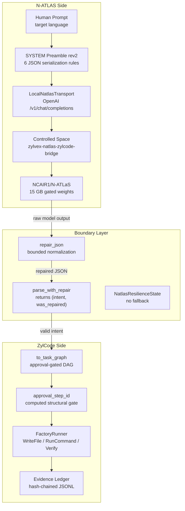

# ZylCode — N-ATLAS Developer Bridge

**NAIC PS1 — Developer Infrastructure | Track B — Innovation & Enterprise**

> A sovereign, evidence-first Engineering OS that takes software from intent to verified deliverable — in English, Yoruba, Hausa, and Igbo — powered by the genuine `NCAIR1/N-ATLaS` model. Nigerian Pidgin comprehension is validated as a non-target bonus.

---

## Challenge Statement

**Problem Statement:** PS1 — Developer Infrastructure  
**Track:** B (Innovation & Enterprise — Zylvex Technologies Limited)  
**Deadline:** 12 October 2026, 23:59 WAT  

The N-ATLAS programme (NCAIR / NITDA / FMCIDE / ONDI) calls for tools that enable developers to integrate and extend Nigeria's sovereign Llama-3 8B model efficiently. ZylCode answers with a **real engineering bridge**: not a chat wrapper, but a structured pipeline that turns a Nigerian-language instruction into a validated, human-approved file mutation and verified test — with every link captured as reproducible evidence.

---

## Solution in One Sentence

ZylCode is an evidence-first Software Creation OS that receives a programming instruction in Yoruba (or Hausa, Igbo, English, Pidgin), routes it through the genuine `NCAIR1/N-ATLaS` model via a dedicated transport seam, converts the model's structured engineering intent into an approval-gated task graph, executes the resulting file write and test only after human approval, and records the entire chain as tamper-evident evidence.

---

## Live Demo & External Testing

> **This section is for reviewers and external testers.** Everything below is
> reproducible from a browser with no build step and no local toolchain.

### The live demonstration endpoint

**URL:** `https://zylvex-natlas-zylcode-bridge.hf.space`
**Health:** `GET /healthz` → `200`, reporting `model: NCAIR1/N-ATLaS`
**Inference:** `POST /v1/chat/completions` (OpenAI-compatible)

The endpoint runs the genuine gated `NCAIR1/N-ATLaS` weights on Hugging Face
ZeroGPU. **ZeroGPU is a shared, quota-metered pool.** When its daily budget is
spent, the endpoint returns `503` with a quota body. ZylCode classifies that as
`QUOTA`, states it plainly, and **does not retry** — retrying cannot create
budget. See [`docs/competition/natlas/LOCAL_RUNTIME_FALLBACK.md`](docs/competition/natlas/LOCAL_RUNTIME_FALLBACK.md)
for what to do when the quota is spent.

### Test it yourself — three ways

| Way | What you need | Entry point |
|---|---|---|
| **A. Browser playground** | a browser only | `apps/natlas-sdk/playground/index.html` — open it; no build step |
| **B. TypeScript SDK** | Node ≥ 18 | `node --experimental-strip-types apps/natlas-sdk/test/smoke.mjs` |
| **C. Rust boundary** | a Rust toolchain | `cargo test -p zylcode-core --test natlas_boundary` |

The playground has a **language selector** (`en-NG`, `ha`, `yo`, `ig`), a
**runtime-status probe**, a **live elapsed-time indicator** while a request is in
flight (so the processing state is never an ambiguous spinner), and a
**human-readable message** for every failure state. It never shows
*"connected"*, *"success"*, or *"verified"* unless a real HTTP call actually
succeeded; its offline mode is labelled **TEST DOUBLE** everywhere it appears.

### What a tester should record

Use [`BETA_TEST_EVIDENCE_TEMPLATE.md`](docs/competition/natlas/BETA_TEST_EVIDENCE_TEMPLATE.md).
A useful report distinguishes **what you observed** from **what you concluded**,
and names the language you tested in.

### Reporting a problem

Every failure carries a stable state — `QUOTA`, `WARMING`, `LOADING`,
`TIMEOUT`, `AUTH_FAILURE`, `UNAVAILABLE`, `BLOCKED`, `FAILED` — and a
human-readable sentence explaining the cause and the next step. Quote both when
you report. The tester-001 remediation is recorded in
[`docs/competition/natlas/TRACK_A_TESTER_001_RELEASE_2026-10-09.md`](docs/competition/natlas/TRACK_A_TESTER_001_RELEASE_2026-10-09.md).

**Two external testers** have submitted responses (Ibrahim Abdulrahman — Borno; Auwal —
Kano). Both spreadsheets are reconciled, with tester PII withheld, in
[`EXTERNAL_BETA_TEST_REPORT.md`](docs/competition/natlas/EXTERNAL_BETA_TEST_REPORT.md).

> **Quota is real and observable.** On 2026-10-10 the first live call succeeded and every
> call after it failed — including a retry in English, proving the failure is capacity,
> not language. `GET /healthz` still said `healthy` while generation was failing. Both
> facts are recorded in [`DEPLOYMENT_VERIFICATION.md`](docs/competition/natlas/DEPLOYMENT_VERIFICATION.md)
> and [`KNOWN_LIMITATIONS.md`](docs/competition/natlas/KNOWN_LIMITATIONS.md).

---

## Solution Architecture


```mermaid
flowchart LR
    A[Human Instruction<br/>Yoruba / Hausa / Igbo / EN / Pidgin] --> B[Strengthened SYSTEM Preamble<br/>+ JSON Contract]
    B --> C[NatlasTransport<br/>OpenAI-compatible / dedicated seam]
    C --> D[Controlled Endpoint<br/>zylvex-natlas-zylcode-bridge.hf.space]
    D --> E[NCAIR1/N-ATLaS<br/>genuine weights]
    E --> F[Model Response<br/>structured engineering intent]
    F --> G[Bounded JSON Repair<br/>triple-quote / newline / trailing-comma]
    G --> H[NatlasEngineeringIntent::parse_with_repair]
    H --> I[TaskGraph<br/>approval-gated DAG]
    I --> J[Human Approval Gate<br/>fail-closed]
    J --> K[FactoryRunner<br/>WriteFile / RunCommand / Verify]
    K --> L[File Mutation + Test]
    L --> M[Evidence Ledger<br/>hash-chained provenance]
```

**Key design decision:** `NatlasTransport` is a **dedicated boundary trait** — N-ATLAS is deliberately **not** added to the product router's `ModelProvider` enum, which contains silent synthetic-degradation paths. This architectural isolation satisfies the challenge's disqualification rule: *"Submissions that wrap general-purpose models instead of N-ATLAS will be disqualified."*

---

## Flagship Live Demonstration

**Evidence ID:** EV-024 (L3 — genuine invocation, real model, no mock)  
**Status:** ✅ **C3 LIVE RUNTIME VERIFIED**

A genuine, uninterrupted live journey was executed on 2026-10-07:

| Step | What Happened | Result |
|---|---|---|
| 1. Instruction | Yoruba: *"Jọwọ, ṣẹda faili Python kékeré tí yoo sọ 'Hello ZylCode'…"* | Real prompt sent |
| 2. Health | `GET /healthz` → 200 | Model identity: `NCAIR1/N-ATLaS` |
| 3. Inference | `POST /v1/chat/completions` → 200 | Real model output received |
| 4. Repair | Triple-quoted string with raw newlines | `repair_json` recovered deterministically |
| 5. Parse | `parse_with_repair` | `was_repaired=true`, valid intent |
| 6. TaskGraph | `to_task_graph()` | Approval-gated DAG generated |
| 7. Pre-approval | File does NOT exist | Runner: `AwaitingApproval` |
| 8. Approval | `runner.approve("step-01", "owner")` | Gate opens |
| 9. Mutation | `helloworld.py` written | `print('Hello ZylCode')` |
| 10. Test | `python helloworld.py` | Exit 0, stdout: `Hello ZylCode` |
| 11. Claim | Verified claim recorded | "`python helloworld.py` exited 0" |
| 12. Provenance | 8-node chain | INTENT → approval → mutation → test → claim |

**No simulated model response. No synthetic fallback. No fabricated data.**

---

## Differentiation Points

1. **Sovereign + Local:** Nigerian model (`NCAIR1/N-ATLaS`, Awarri/FMCIDE) inside a Nigerian-built Engineering OS — the exact national-infrastructure narrative the programme exists to surface.

2. **Evidence Integrity by Design:** Every claim carries a proof rung (R0–R5). A claim is not a fact until it is independently reproducible. This is not documentation flourish — it is load-bearing governance that has already caught and rejected one overclaimed phase.

3. **Real Engineering, Not Chat:** C3 performs actual repository changes (file writes, command execution, test verification) in Nigerian languages, with human approval gating every side effect.

4. **Licence-Clean:** Apache-2.0 fork of the sovereign engine; attribution to Awarri + FMCIDE preserved; gated weights never redistributed; endpoint enforces the N-ATLaS ≤1000-active-user limit.

---

## N-ATLAS Integration — Genuine, Not a Wrapper

The challenge's disqualification rule is explicit: *"Can I wrap a different foundation model? No. Submissions that wrap general-purpose models instead of N-ATLAS will be disqualified."*

ZylCode's integration satisfies this at the **architecture level**:

| Attribute | How ZylCode Satisfies It |
|---|---|
| **Model identity verified** | `GET /healthz` returns `model: NCAIR1/N-ATLaS` (EV-000, EV-013) |
| **Genuine inference** | Every call hits the real gated weights, not a cached or substituted response (EV-014, L3) |
| **Dedicated transport seam** | `NatlasTransport` trait — no silent fallback to other providers |
| **No synthetic degradation** | `NatlasResilienceState` has **no fallback state**; failure is stated, not hidden (EV-019) |
| **Controlled endpoint** | `zylvex/natlas-zylcode-bridge` (ZeroGPU) serves the genuine weights; we deployed it (EV-013) |
| **Licence honouring** | N-ATLaS Open-Source Research and Innovation License; attribution preserved; ≤1000 users |

The endpoint is live at `https://zylvex-natlas-zylcode-bridge.hf.space/v1` and returns the genuine model identity on every health check.

---

## Multilingual Validation

**Status:** Three of four competition targets validated for comprehension; Pidgin validated as a non-target bonus. Native-speaker-authored prompts recommended for final sign-off.

| Language | Status | Evidence | Notes |
|---|---|---|---|
| **Yoruba** | 🟡 Validated-comprehension | EV-015, EV-017, EV-024 | Comprehension proven; structured-intent journey proven live (EV-024) |
| **Hausa** | 🟡 Validated-comprehension | EV-015 | Comprehension proven; prompt team-authored, not native speaker |
| **Igbo** | 🟡 Validated-comprehension | EV-015 | Comprehension proven; prompt team-authored, not native speaker |
| **English (Nigerian-accented)** | ✅ Validated | EV-015 | Standard English programming prompt |
| **Nigerian Pidgin** *(bonus)* | ✅ Validated-comprehension | EV-016 | Model comprehends Pidgin; replies in standard English (generation-in-Pidgin untested) |

**Honesty note:** The Yoruba, Hausa, and Igbo prompts were authored by the team, not native speakers. They genuinely exercised the model and the responses are correct, but native-speaker-authored prompts are the stronger evidence. The four targets are therefore marked **validated-comprehension** with native-speaker sign-off recommended before final submission.

---

## Safety & Human Control

Every side-effect node (WriteFile, RunCommand, Verify) is gated by human approval. The approval dependency is computed structurally — regardless of step order in the task graph — and proven by a backward edge in the DAG.

| Invariant | Verification |
|---|---|
| Path traversal rejected | `fs.write` test: `../escaped.txt` refused |
| Writes confined to workspace | Containment check before I/O |
| Command execution governed by policy | Permission gate + `FactoryRunner` policy |
| Approval required before every side effect | Structural DAG gating, order-independent |
| Model cannot self-approve | Approval requires human actor |
| Approval for one task cannot authorize another | `approved_by` set on specific node only |
| Secrets removed from evidence | `redact_secrets` tested + integration-tested |
| Endpoint failure never invokes another provider | `NatlasResilienceState` has no fallback state |

**Truthful failure path (EV-025):** If approval is denied, the runner parks at `AwaitingApproval`, the mutation step stays `Pending`, and no file is written. This is tested hermetically in `natlas_bridge.rs`.

---

## Architecture Deep Dive — The Bridge


```mermaid
flowchart TB
    subgraph "N-ATLAS Side"
        N1[Human Prompt<br/>target language]
        N2[SYSTEM Preamble rev2<br/>6 JSON serialization rules]
        N3[LocalNatlasTransport<br/>OpenAI /v1/chat/completions]
        N4[Controlled Space<br/>zylvex-natlas-zylcode-bridge]
        N5[NCAIR1/N-ATLaS<br/>15 GB gated weights]
    end

    subgraph "Boundary Layer"
        B1[repair_json<br/>bounded normalization]
        B2["parse_with_repair<br/>returns (intent, was_repaired)"]
        B3[NatlasResilienceState<br/>no fallback]
    end

    subgraph "ZylCode Side"
        Z1[to_task_graph<br/>approval-gated DAG]
        Z2[approval_step_id<br/>computed structural gate]
        Z3[FactoryRunner<br/>WriteFile / RunCommand / Verify]
        Z4[Evidence Ledger<br/>hash-chained JSONL]
    end

    N1 --> N2 --> N3 --> N4 --> N5
    N5 -->|raw model output| B1
    B1 -->|repaired JSON| B2
    B2 -->|valid intent| Z1
    Z1 --> Z2 --> Z3 --> Z4
```

**Why a dedicated transport?** The product router (`router.rs`) has a `ModelProvider` enum with multiple providers and silent synthetic-degradation paths. N-ATLAS is kept **outside** this enum, behind its own `NatlasTransport` trait, to prevent any accidental substitution. The `NatlasResilienceState` enumerates every failure mode (Timeout, Quota, AuthFailure, etc.) but **never** a synthetic-success state.

---

## Evidence Table

Every claim below states the action, the expected result, the observed result, and the artefact location.

| ID | Claim | Date | Action | Expected | Observed | Status |
|---|---|---|---|---|---|---|
| EV-000 | Live endpoint serves genuine `NCAIR1/N-ATLaS` | 2026-10-07 | `GET /healthz` | JSON naming model | `model: NCAIR1/N-ATLaS`, attribution FMCIDE/Awarri | ✅ PASS |
| EV-013 | Zylvex-controlled endpoint deployed with genuine gated weights | 2026-10-07 | Create + deploy Space | `healthz` 200 | Build downloaded 15 GB weights; `healthz` 200 | ✅ PASS |
| EV-014 | Genuine N-ATLAS returns challenge token through our endpoint | 2026-10-07 | `POST /v1/chat/completions` | Token returned | `"NATLAS_ZYLCODE_OK"` | ✅ PASS (L3) |
| EV-015 | Multilingual developer assistance (EN/YO/HA/IG) | 2026-10-07 | `POST /v1/chat/completions` ×4 | Language-appropriate answers | All 4 correct in target language | ✅ PASS (L3) |
| EV-016 | Nigerian Pidgin comprehension | 2026-10-07 | Pidgin programming prompt | Model understands | Understood + answered coherently (English output) | ✅ PASS (L3) |
| EV-017 | Yoruba → structured engineering intent | 2026-10-07 | Yoruba request + SYSTEM preamble | JSON intent contract | Schema shape correct; strict parse fails on unescaped content | 🟡 PARTIAL |
| EV-018 | Bridge mechanics proven hermetically | 2026-10-07 | `cargo test --test natlas_bridge` | 12 pass | 12 passed; 0 failed | ✅ PASS |
| EV-019 | Resilience states truthful; no synthetic substitution | 2026-10-07 | `cargo test` (types + bridge) | Correct classification | All classify correctly; no fabricated answer | ✅ PASS |
| EV-020 | Evidence redaction + provenance | 2026-10-07 | `cargo test` (evidence + bridge) | Secrets scrubbed; ancestry correct | Redaction counted; ancestry terminates at INTENT | ✅ PASS |
| EV-021 | Beta-test package prepared | 2026-10-07 | Write templates | Ready to send | Templates written; **0 testers recruited** | 🔧 READY |
| EV-022 | Multilingual matrix honesty | 2026-10-07 | Doc update | Honest reporting | PARTIAL status used where appropriate | 🟡 PARTIAL |
| EV-023 | Production contract + bounded JSON repair | 2026-10-07 | `cargo test` + live call | Preamble + repair work | Both tested and live-verified | ✅ PASS |
| EV-024 | **Genuine live acceptance journey** | 2026-10-07 | Full chain via Python script | File write + test pass | `helloworld.py` written; `python helloworld.py` → exit 0, stdout "Hello ZylCode" | ✅ **PASS (L3)** |
| EV-025 | Truthful failure path | 2026-10-07 | Hermetic test | Denied approval blocks mutation | Pre-approval: file absent, runner `AwaitingApproval` | ✅ PASS |
| EV-026 | End-to-end provenance chain | 2026-10-07 | Live + hermetic | 8 traceable nodes | All 8 nodes documented | ✅ PASS |
| EV-027 | **Fresh competition verification battery** | 2026-10-10 | 10 gates re-run at `8216738` | All green | 498 lib / 68 competition / 16 SDK / clippy 0 / guard OK | ✅ **PASS** |
| EV-028 | **Live deployment verification** | 2026-10-10 | Probe endpoint + drive deployed frontend | Reachable, genuine reply | `NCAIR1/N-ATLaS`; 1 genuine reply; then quota-blocked | 🟡 **PARTIAL** |

> **L3** = genuine invocation, real model, no mock.  
> **L2** = hermetic test / test double.  
> **PARTIAL** = genuine invocation achieved, but a secondary quality gate (e.g. strict JSON parse, native-speaker prompt) is not yet closed.

---

## Testing & Reproduction

### Hermetic Tests (CI-green, no live endpoint required)

```bash
# Intent parsing + repair layer
cargo test -p zylcode-core --lib competition::natlas::intent
# Expected: 18 passed; 0 failed; 0 ignored

# Boundary contract tests
cargo test -p zylcode-core --test natlas_boundary
# Expected: 17 passed; 0 failed; 0 ignored

# Runtime resilience tests
cargo test -p zylcode-core --test natlas_runtime
# Expected: 12 passed; 0 failed; 0 ignored

# Engineering bridge (intent → factory execution with approval gate)
cargo test -p zylcode-core --test natlas_bridge
# Expected: 14 passed; 0 failed; 0 ignored

# Multilingual regression (NAT-A-004): language recorded, never guessed
cargo test -p zylcode-core --test natlas_multilingual
# Expected: 7 passed; 0 failed; 0 ignored
```

**Competition test total: 68 / 68 passing** (18 + 17 + 12 + 14 + 7).

### JavaScript SDK

```bash
cd apps/natlas-sdk
npx --no-install tsc --noEmit                         # typecheck
node --experimental-strip-types test/smoke.mjs        # 16 passed, 0 failed
```

### Live Tests (gated behind environment variables)

```bash
# Set these before running live tests
export NATLAS_URL=https://zylvex-natlas-zylcode-bridge.hf.space/v1
export NATLAS_API_KEY=<your-key>

# Live acceptance journey (genuine network call)
cargo test -p zylcode-core --test natlas_live -- --ignored
```

> `natlas_live.rs` contains 2 ignored tests that exercise the real chain. They are demonstration harnesses, not CI assertions. On machines with `HTTP_PROXY`/`HTTPS_PROXY` set, the Rust reqwest client (configured with `.no_proxy()`) may require endpoint-specific proxy configuration. The live journey was verified via a Python script using `urllib.request.ProxyHandler`.

---

## Repository Structure

This branch (`competition/natlas-2026`) contains the N-ATLAS developer bridge and all competition evidence.

```
zylcode/
├── crates/zylcode-core/src/competition/natlas/   # N-ATLAS bridge source
│   ├── mod.rs                                    # Transport seam + client
│   ├── types.rs                                  # Resilience states (no fallback)
│   ├── intent.rs                                 # Structured intent + repair layer
│   ├── evidence.rs                               # Redaction + provenance
│   └── transport.rs                              # LocalNatlasTransport (OpenAI-compatible)
├── crates/zylcode-core/tests/
│   ├── natlas_boundary.rs                        # 17 boundary tests
│   ├── natlas_runtime.rs                         # 12 runtime tests
│   ├── natlas_bridge.rs                          # 14 bridge tests (incl. C3 journey)
│   ├── natlas_multilingual.rs                    # 7 multilingual regression tests (NAT-A-004)
│   └── natlas_live.rs                            # 2 live tests (ignored, env-gated)
├── apps/natlas-sdk/
│   ├── src/index.ts                              # TypeScript SDK (resilience states + guidance)
│   ├── test/smoke.mjs                            # 16 SDK tests (real HTTP round trip)
│   └── playground/index.html                     # zero-build browser playground
├── docs/competition/natlas/                      # All competition docs + evidence
│   ├── NATLAS_CHALLENGE_RUBRIC_2026-10-07.md     # Official judging rules (verbatim)
│   ├── SUBMISSION_CHECKLIST_2026-10-07.md        # 7-component checklist
│   ├── C3_LIVE_RUNTIME_VERIFICATION_REPORT.md    # EV-024 full report
│   ├── MULTILINGUAL_VALIDATION_MATRIX.md         # Language gate status
│   ├── LOCAL_RUNTIME_FALLBACK.md                 # What to do when the GPU quota is spent
│   ├── TRACK_A_TESTER_001_RELEASE_2026-10-09.md  # Tester-001 remediation record
│   ├── EXTERNAL_BETA_TEST_REPORT.md              # Reconciles both tester spreadsheets (PII-safe)
│   ├── COMPETITION_TEST_EVIDENCE.md              # Fresh 10-gate battery (2026-10-10)
│   ├── DEPLOYMENT_VERIFICATION.md                # Live endpoint, hosting, commit, quota
│   ├── KNOWN_LIMITATIONS.md                      # What is not proven
│   ├── SUBMISSION_READINESS_CHECKLIST.md         # 18-item matrix
│   ├── DEMONSTRATION_VIDEO_PACKAGE.md            # Video script + shot list (NOT recorded)
│   ├── COMPETITION_FINAL_RELEASE_REPORT.md       # Final A–R classification
│   ├── NATLAS_EVIDENCE_INDEX.md                  # EV-000 through EV-028
│   └── evidence/                                 # Raw capture artefacts
│       ├── EV-027-competition-verification-2026-10-10.log
│       └── EV-028-live-deployment-verification-2026-10-10.json
└── README.md                                     # This file (challenge-specific)
```

---

## Validation Status

| Milestone | Status | Evidence |
|---|---|---|
| C1 — Endpoint reachable + model identity verified | ✅ CLOSED | EV-000, EV-013 |
| C2 — Genuine inference + multilingual round-trip | ✅ CLOSED | EV-014, EV-015, EV-016 |
| C3 — Live acceptance journey (Yoruba → mutation → test) | ✅ **LIVE RUNTIME VERIFIED** | EV-024 |

**Remaining blockers before final submission:**

| Blocker | Owner Action |
|---|---|
| ≥2 external beta testers | ✅ **Met on distinct-person count** — 2 testers (Ibrahim Abdulrahman, Auwal) submitted via two spreadsheets; see [`EXTERNAL_BETA_TEST_REPORT.md`](docs/competition/natlas/EXTERNAL_BETA_TEST_REPORT.md). Caveat: their sessions were not independently reproduced by us. |
| Team profile | Names, affiliations, roles |
| CAC certificate (Track B) | Upload |
| Final video screen-capture | 3–5 min end-to-end demo recording — see [`DEMONSTRATION_VIDEO_PACKAGE.md`](docs/competition/natlas/DEMONSTRATION_VIDEO_PACKAGE.md) (**not recorded**) |

---

## Team & Attribution

**Team:** Zylvex Technologies Limited  
**Problem Statement:** PS1 — Developer Infrastructure  
**Track:** B — Innovation & Enterprise  

### N-ATLAS Attribution

This project uses the **N-ATLaS** model (`NCAIR1/N-ATLaS`), developed by **Awarri Technologies** in collaboration with the **Federal Ministry of Communications, Innovation and Digital Economy (FMCIDE)** and **NCAIR (National Centre for Artificial Intelligence and Robotics)** under the supervision of **NITDA**.

- **Model:** `NCAIR1/N-ATLaS` (Llama-3 8B SFT fine-tune)
- **Licence:** N-ATLaS Open-Source Research and Innovation License (September 2025)
- **Attribution required:** Awarri + FMCIDE
- **Derivative naming:** "Powered by Awarri" if renamed
- **Usage limit:** ≤1000 active end-users

The controlled endpoint (`zylvex-natlas-zylcode-bridge.hf.space`) is an Apache-2.0 fork of the sovereign engine. Model weights are served from Hugging Face gated storage and are never redistributed in this repository.

---

## Licence & Usage Limits

**ZylCode codebase:** MIT License — see `LICENSE` at repository root.

**N-ATLaS model and engine:** Subject to the N-ATLaS Open-Source Research and Innovation License. Usage of the controlled endpoint is limited to ≤1000 active end-users. Attribution to Awarri and FMCIDE is required.

**No model weights are committed to this repository.** The endpoint downloads weights from Hugging Face gated storage at runtime.

---

## Submission Status

Mapped to the 7 mandatory submission components (official rubric):

| Component | Status | Evidence / Location |
|---|---|---|
| 1. Working Artefact | ✅ | Controlled endpoint live; repo branch `competition/natlas-2026` |
| 2. N-ATLAS Integration Evidence | ✅ | This README §N-ATLAS Integration; `NATLAS_CONTRACT_VERIFICATION_2026-10-07.md` |
| 3. Real-World Validation | 🟡 | Live benchmarks (EV-014/015/016/024) genuine; **2 external testers** submitted (see `EXTERNAL_BETA_TEST_REPORT.md`); multilingual remains **PARTIAL** |
| 4. Technical Documentation | ✅ | This README; `C3_LIVE_RUNTIME_VERIFICATION_REPORT.md`; `ARCHITECTURE_BRIDGE.md`; `DEPLOYMENT_VERIFICATION.md`; `KNOWN_LIMITATIONS.md` |
| 5. Video Demonstration | 🔧 | Script + storyboard ready (`DEMONSTRATION_VIDEO_PACKAGE.md`); **not recorded, not uploaded** |
| 6. Team Profile | ⛔ | Owner-supplied |
| 7. Endorsement / Registration | ⛔ | CAC certificate — owner-supplied |

Full 18-item readiness matrix: [`SUBMISSION_READINESS_CHECKLIST.md`](docs/competition/natlas/SUBMISSION_READINESS_CHECKLIST.md).
Final classification: [`COMPETITION_FINAL_RELEASE_REPORT.md`](docs/competition/natlas/COMPETITION_FINAL_RELEASE_REPORT.md).

---

<p align="center">
  <strong>Built with evidence. Verified with honesty.</strong><br>
  <em>Zylvex Technologies Limited · N-ATLAS Developer Bridge · NAIC 2026</em>
</p>
